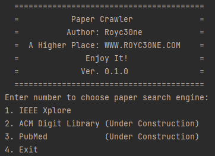

# Paper Search Engine Spider

# Version 0.1.0 — Updated 2022-2-3

An Object-oriented paper search crawler 

## Features:

1. You can search papers via command line interactions
2. You can search papers on IEEE Xplore Search Engine
3. It will return a *.ris file contain all the result paper

## To be fixed:

1. Auto Cookie Fetch will be added in the future
2. More paper search engine will be added in the future (PubMed | ACM Digit Library)
3. Web based script will be added in the future

## How to Use :

*Make sure you have installed Python 3

*Make sure you have install the environment required in the requirements.txt

*If you are runing this script with Windows, Make sure you open the file with Administrator (You can use “Ctrl + Shift + [Double Click/Enter]” to start with the file )

1. Run [run.py](http://run.py)  and follow the command line
2. Choose Your Search Engine
3. Type your search content
4. Wait with a cup of coffee
5. You can find your ris file in the *_RIS_Dir folder

## API Comments:

`IEEE_Xplore_Spider` Comments will be added in the future